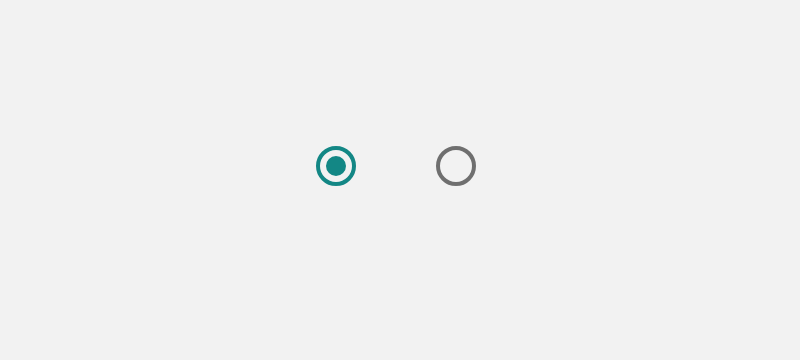

# Material Design Web UI Components

## Overview

 Material을 이용한 웹디자인 및 웹개발에 도움이 되기 위해 공식 홈페이지에서 정보가 제공되는 컴포넌트를 나열합니다. UI 컴포넌트가 아닌 것\(눈에 보이지 않거나 독립적으로 존재할 수 없는 컴포넌트\)과 추후에 사라질 컴포넌트\(MDCGridList, MDCToolbar등\)은 제외합니다.

### 1. 버튼\(Buttons\)



### 2. 카드\(Cards\)



### 3. 칩\(Chips\)



### 4. 다이얼로그\(Dialog\)



### 5. 드로어\(Drawers\)



### 6. 이미지 리스트\(Image List\)



### 7. 양식 필드\(Form Fields\)



### 8. 레이아웃 그리드\(Layout Grid\)



### 9. 선형 진행\(Linear Progress\)



### 10. 리스트\(Lists\)



### 11. 메뉴\(Menus\)



### 12. 리플\(Ripple\)



### 13. 스낵바\(Snackbars\)



### 14. 탭바\(Tab Bar\)



### 15. 탑앱바\(Top App Bar\)



